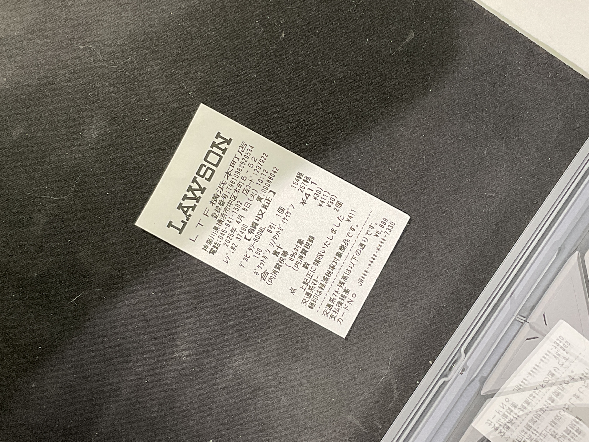

# Удаление теней с фотографий документов

В рамках курсовой работы реализовано приложение для удаления теней с фотографий.

За основу взят water-filling алгоритм и был немного улучшен.  

В рамках работы необходимо передать сами фотографии, разметку в формате JSON, коэффициент сжатия, а также эталоны для вычисления метрик PSNR и MSSIM

## Примеры
Примеры входных и выходных фотографий:

Input:

Output:
