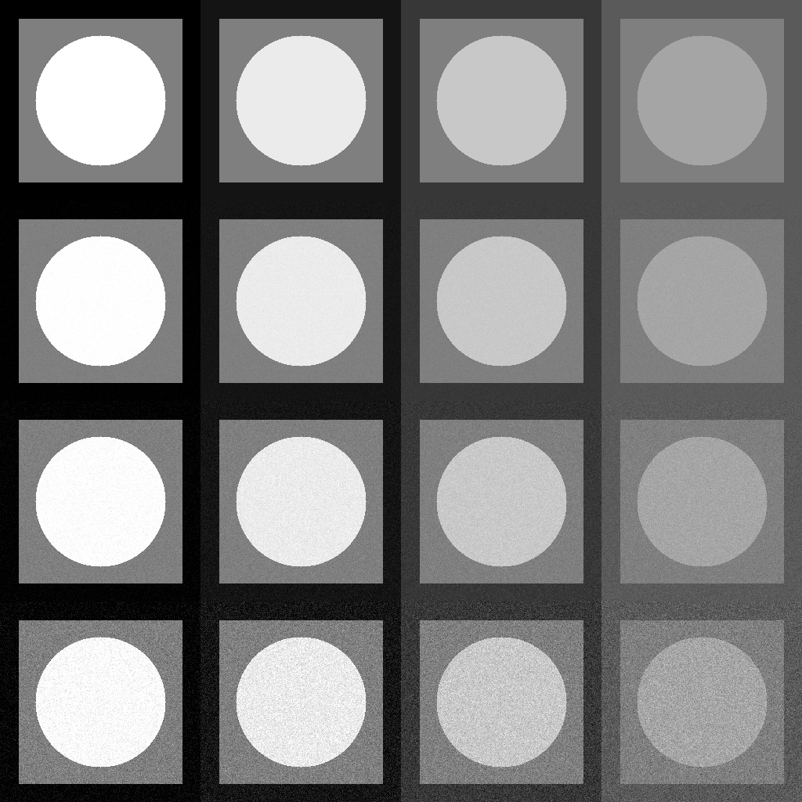
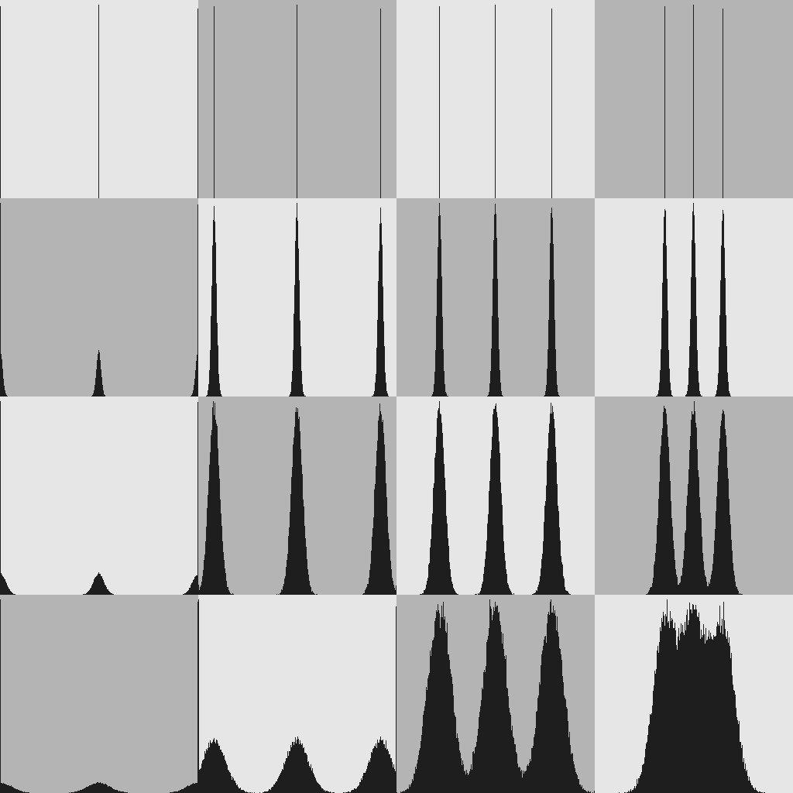

# Лабораторная работа 2

## Что было сделано

В этой лабораторной работе было реализовано:
* генерация тестовых изображений
* добавление шума
* анализ статистических параметров
* визуализация гистограмм яркости

## Часть 1

Создание тестовых изображений происходит с помощью функции 
```
cv::Mat gen_tgtimg00(const int lev0, const int lev1, const int lev2)
```

Генерируются изображения с заданным уровнем яркости и размерами:
* 256 - сторона изображения
* 209 - сторона внутреннего квадрата
* 83 - радиус круга


Затем они склеиваются в коллаж с добавлением нормального несмещенного шума с заданным значением среднеквадратичного отклонения std
```
cv::Mat add_noise_gau(const cv::Mat& img, const int std)
```

Полученный коллаж:


## Часть 2

### Расчет
Рассчитываются среднее значение яркости и стандартного отклонения для каждого начального изображения.
Эти рассчеты производятся для 3 областей:
* Фон (BG)
* Квадрат (Square)
* Круг (Circle)

**[Вычисленные значения](stats)**

### Сравнение с теоритическими
После вычисления практических значений статистики приблизительно равны теоретическим значениям
(в пределах 10% погрешности)

На зашумленных картинках появляется незначительное изменение яркости

### Полученная гистограмма
