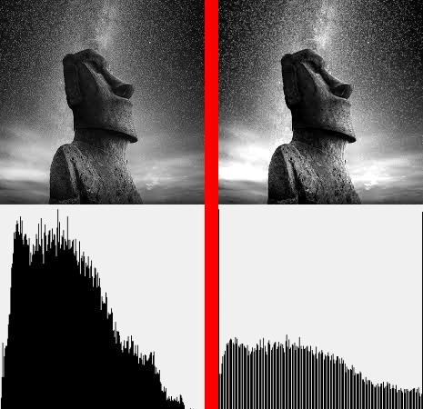
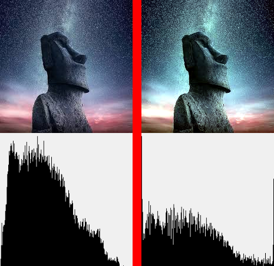
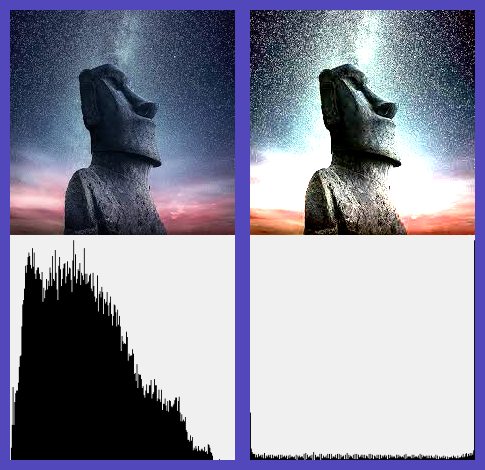
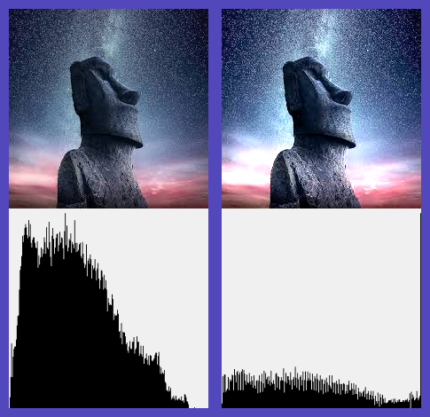

# Лабораторная работа 3

## Что было сделано

* функция наивного и ограниченного автоконтраста
* проверка различных типов изображений


```bash
./task03 <input_image> <output_image> <output_collage_image> <q_black> <q_white> [naive|rgb]
```

## Часть 1

Для серого одноканального изображения с квантилями 0.02 для черного и 0.98 для белого:



Можно заметить, что черных и белых пикселей стало больше, засчет отсекания остальных пикселей

Для цветного изображения с наивным автоконтрастом с квантилями 0.02 и 0.98:



Для цветного изображения с наивным автоконтрастом с квантилями 0.05 и 0.8:



## Часть 2

Для цветного изображения с ограниченным автоконтрастом с квантилями 0.05 и 0.8:


Для цветного изображения с наивным автоконтрастом с квантилями 0.02 и 0.93:

