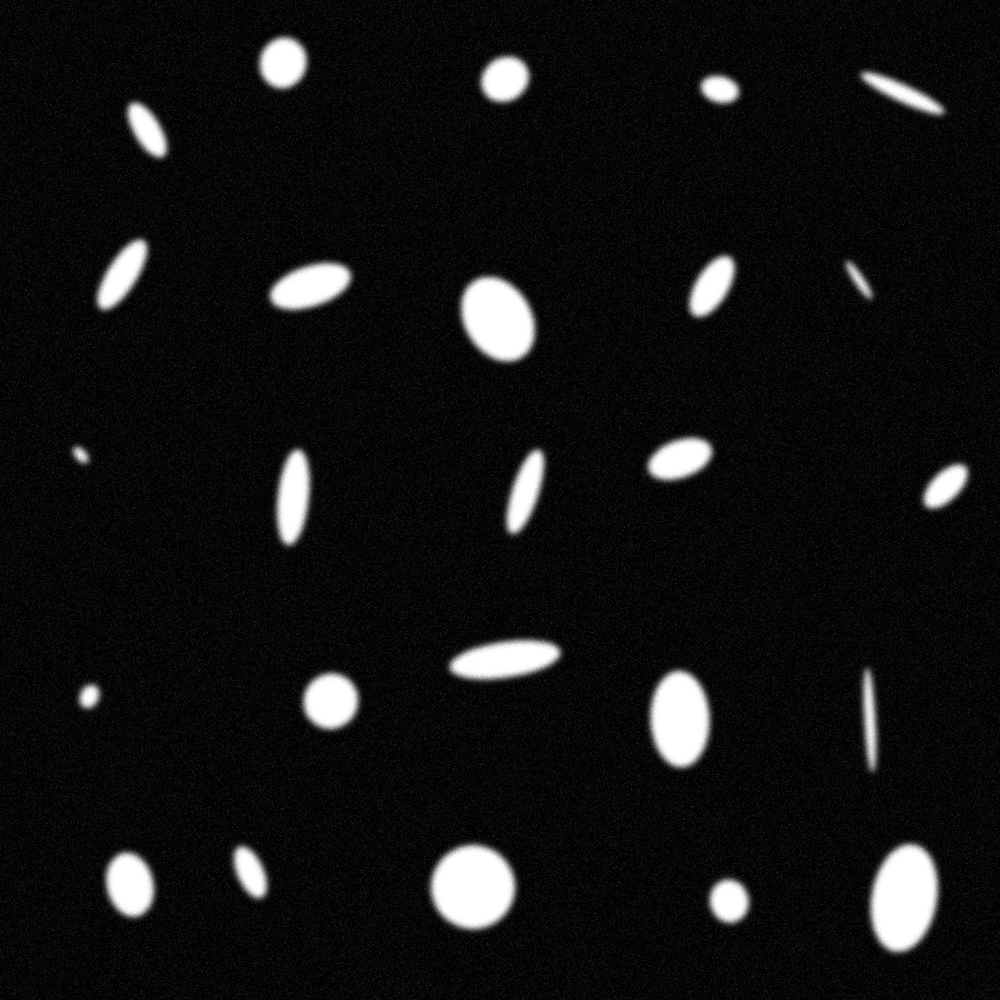
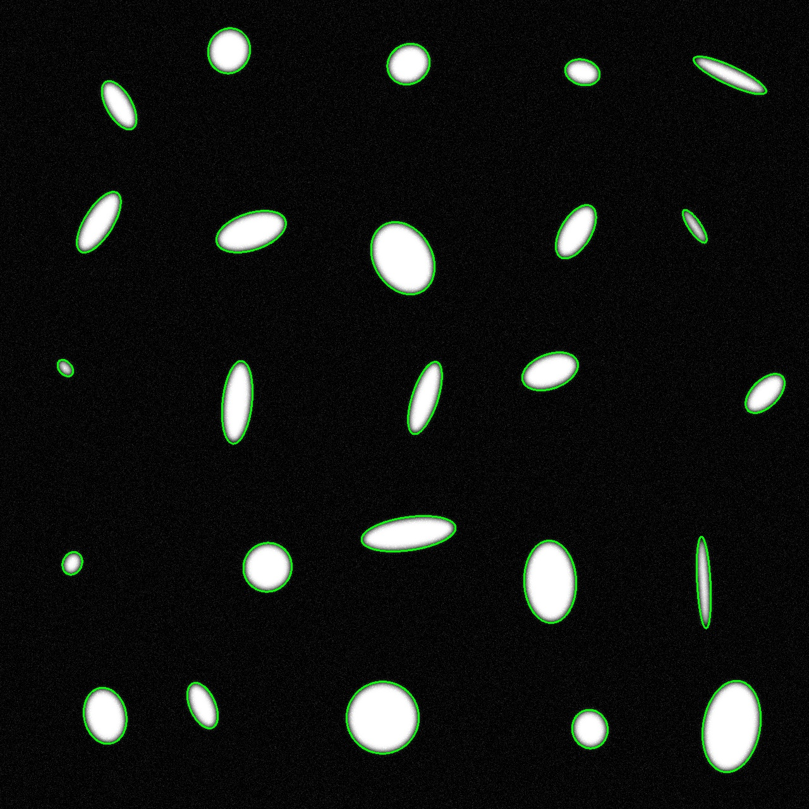

# Лабораторная работа 4

## Часть 1. Создание коллажа

```
Usage: ./task04_01 <config_path> [<output_image_path> <output_gt_path> [seed]]
```

Конфиг файл выглядит следующим образом:

```json
{
    "bg_color": 0,
    "blur_size": 25,
    "elps_color": 255,
    "max_elps_height": 150,
    "max_elps_width": 160,
    "min_elps_height": 10,
    "min_elps_width": 20,
    "n": 5,
    "noise_std": 15.0
}
```

Пример получившегося файла:



Коллаж из 5 изображений 256x256 с эллипсами.

Применяется **cv::GaussianBlur(collage, collage, cv::Size(blur_size_adj, blur_size_adj), 0);**

Также проверяются границы, чтобы эллипсы не входили в область в 32 пикселя от границ

Дополнительно сохраняется json файл эталона. Пример [collage_gt.json](collage_gt.json):

```json
{
    "blur_size": 25,
    "colors": {
        "bg_color": 0,
        "elps_color": 255
    },
    "noise_std": 15.0,
    "objects": [
        {
            "elps_parameters": {
                "elps_angle": 149.48000387261203,
                "elps_height": 78,
                "elps_width": 33,
                "elps_x": 188,
                "elps_y": 166
            },
            "pic_coordinates": {
                "col": 0,
                "row": 0
            }
        },
```

## Часть 2. Детекция

```
Usage: ./task04_02 <image_path> <output_json_path>
```

Детекция с помощью Бинаризации, Морфологической операции и Поиска контуров

После выполнения программы остается json конфигурация задетектированных областей. Пример [detect.json](detect.json):
```json
{
    "objects": [
        {
            "elps_parameters": {
                "elps_angle": 167.7847900390625,
                "elps_height": 61.080169677734375,
                "elps_width": 56.00088882446289,
                "elps_x": 932.9224853515625,
                "elps_y": 1153.14892578125
            }
        },
```

А также сохраняется изображение с детекцией для откладки:


## Часть 3. Отчет о качестве

```
Usage: ./task04_03 <gt_list> <detect_list> <protocol_path>
```

После выполнения сохраняется протокол о качестве в указанный путь. lst-файлы содержат пути до json файлов эталона и детекции соответственно.

Пример протокола [protocol](protocol):
```
Quality Assessment Report
=========================

Comparing 1 images

Image	GT	Det	Match	IoU		Center Dist	Size Diff	Angle Diff
---------------------------------------------------------------------
1	25	25	25	0.755		0.174		33.594		86.825

Summary:
---------------------------------------------------------------------
Total GT objects: 25
Total detected objects: 25
Total matched objects: 25
Precision: 1.0000
Recall: 1.0000
F1 Score: 1.0000
Average IoU: 0.755
Average Center Distance: 0.174
Average Size Difference: 33.594
Average Angle Difference: 86.825
```

Как видно из примера, детекция происходит достаточно качественно, считаются следующие метрики: 
* Precision
* Recall
* F1
* IoU(Intersection over Union) - 0.75 это отличный результат
* Расстояния между центрами
* Разница размеров
* Разница углов 