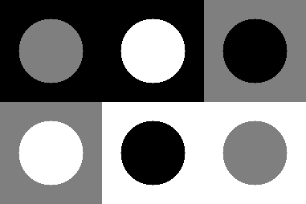
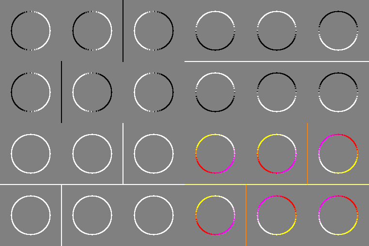

# Лабораторная работа №5

## Часть 1. Генерация Тестового изображения

Тестовое изображение генерируется согласно условию. Серое одноканальное 8bpp из квадратов и кругов.

Геометрические размеры:
* 127 - сторона одного квадрата
* 40 - радиус круга в центре квадарата
* 127 ⋅ 3 - ширина тестового изображения
* 127 ⋅ 2 - высота тестового изображения

Пример тестового изображения: 

## Часть 2. Фильтрация

Фильтрация происходит линейным фильтром с ядрами $M_1$, $M_2$. Третье изображение представляет собой $I_3=\sqrt{I_1^2+I_2^2}$

Четвертое изображение это RGB-изображение, в котором $V_1$ - R-канал, $V_2$ - G-канал, $V_3$ - B-канал

Полученная визуализация в виде коллажа:

