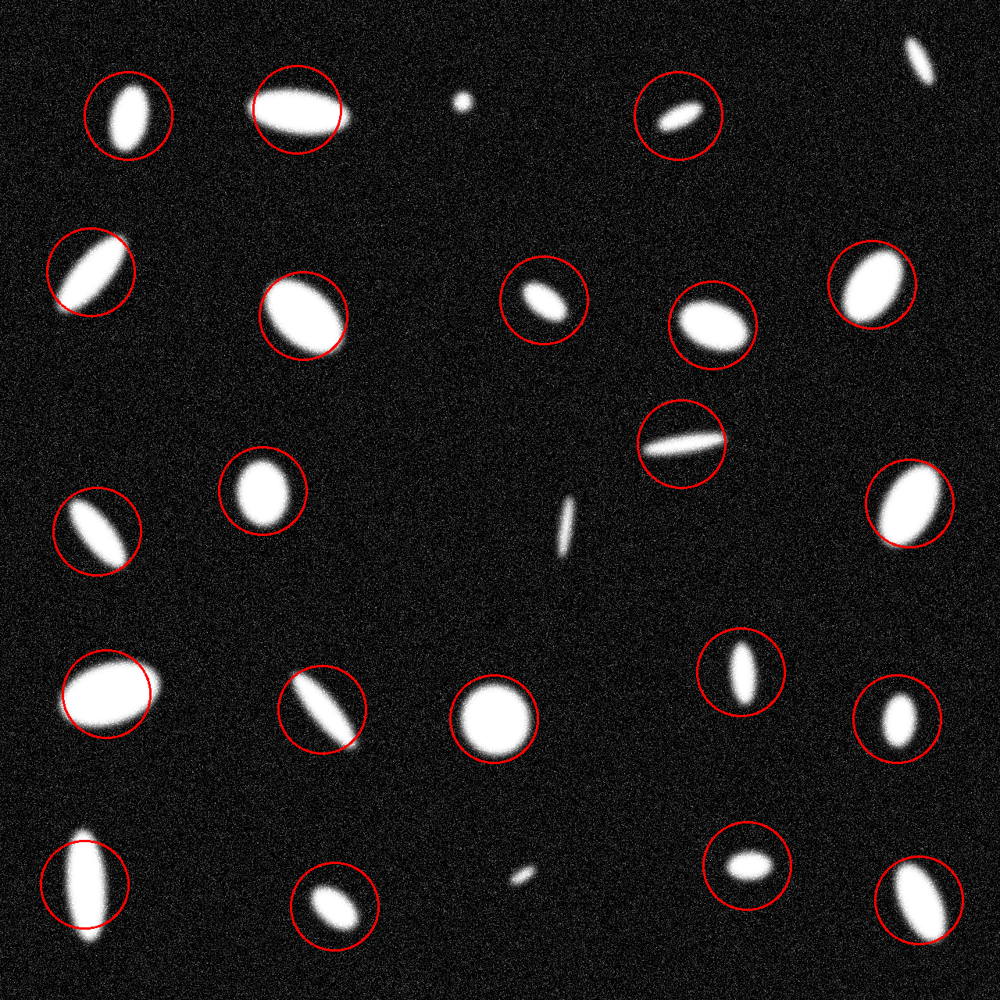

# Лабораторная работа №6

## Часть 1. Создание тестовый данных

Тестовые изображения создаются с помощью task04-01 из 4 ЛР с конфигурацией типа
```json
{
    "bg_color": 0,
    "blur_size": 25,
    "elps_color": 255,
    "max_elps_height": 150,
    "max_elps_width": 160,
    "min_elps_height": 10,
    "min_elps_width": 20,
    "n": 5,
    "noise_std": 44.0
}
```

Использованные тестовые изображения:


## Часть 2. Детекция с помощью LoG/DoG

### Usage:
```
Usage: task06 <image_path> <output_json>
```

Задетектированные данные сохраняются в json файл вида:
```json
{
    "objects": [
        {
            "elps_parameters": {
                "elps_angle": 0.0,
                "elps_height": 113.1029281616211,
                "elps_width": 113.1029281616211,
                "elps_x": 360,
                "elps_y": 80
            }
        },
```

А так же сохраняется визуализация:


Проверка результатов работы реализована с помощью task04-03, полученный [протокол](output/protocol) выглядит следующим образом:
```
Quality Assessment Report
=========================

Comparing 2 images

Image	GT	Det	Match	IoU		Center Dist	Size Diff	Angle Diff
---------------------------------------------------------------------
1	25	21	21	0.376		2.293		44.431		90.078
2	25	21	21	0.370		2.817		44.335		89.280

Summary:
---------------------------------------------------------------------
Total GT objects: 50
Total detected objects: 42
Total matched objects: 42
Precision: 1.0000
Recall: 0.8400
F1 Score: 0.9130
Average IoU: 0.373
Average Center Distance: 2.555
Average Size Difference: 44.383
Average Angle Difference: 89.679
```

Как видно из полученного QA протокола, детекция в большинстве случаев работает корректно, за исключением мелких эллипсов
